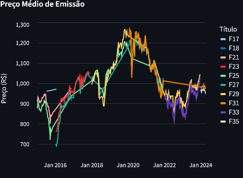
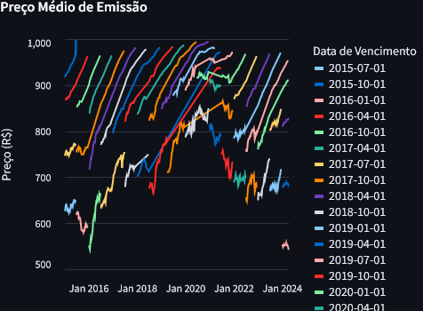

### Precificação de títulos de renda fixa

O preço de um título de renda fixa pode ser calculado a partir da seguinte fórmula:
$$
\begin{equation}
P_{t,T} = \left[\sum_{i=1}^{n} \frac{C_{t_{i}}}{(1+y_{t})^\frac{(t_{i}-t)}{252}}\right] + \frac{M_{T}}{(1+y_{t})^\frac{(T-t)}{252}}
\end{equation}
$$

onde $P_{t, T}$ é o preço do título em $t$ (dias úteis) que vence em $T$ (dias úteis), $C_{t_{i}}$ é o cupom em $t_{i}$, onde $t < t_{i} \leq t_{n} = T$, $M_{T}$ é o principal que vence em $T$ e $y_{t}$ é a *yield to maturity* em $t$. 

Podemos considerar que $t \in \mathbb{Z}$, ou seja, $t$ pode assumir três valores: $t=0$, $t<0$ e $t>0$.

- $\left(t = 0\right)$: Neste caso, estamos calculando o preço atual da LTN, ou seja, o preço no qual o título está sendo negociado no mercado (ou no qual está sendo emitido). A *yield to maturity*  $y_0$ é a taxa pela qual o título é negociado no mercado secundário ou a taxa pela qual a STN emite o papel, que determinará o preço que será pago pela instituição financeira. Essa taxa pode ser determinada por condições de mercado, expectativas de inflação, política monetária e outros fatores econômicos, refletindo o consenso do mercado sobre o valor justo do título naquele momento específico. 

- $\left(t < 0\right)$: Aqui, estamos olhando para o passado e calculando o preço que a LTN teve em um momento anterior à data atual, ou seja, $t$ representa o número de dias úteis no passado a partir do momento presente. A taxa de juros $y_t$ para este caso já é conhecida, pois refere-se a uma taxa que foi efetivamente praticada no mercado naquele ponto do passado. Esse cálculo pode ser útil para análises históricas de preços, avaliação do desempenho de investimentos passados ou para fins de comparação.

- $\left(t > 0\right)$: Neste caso, estamos lidando com uma negociação a termo (contrato futuro), onde o preço é estabelecido hoje para uma transação que ocorrerá em uma data futura especificada. O valor de $t$ indica quantos dias úteis no futuro a transação será realizada. A taxa de juros $y_t$ reflete as expectativas do mercado para a taxa naquela data futura, que pode ser, por exemplo, a taxa forward. Este preço a termo pode ser usado em contratos de forward, operações compromissadas ou outros instrumentos financeiros que envolvem o compromisso de compra ou venda de um título em uma data futura.

Note que no caso de uma análise histórica, podemos simplificar e considerar que $t = 0$ para todo ponto $t < \mathbb{Z}$ em que se deseje precificar um título, que é a abordagem que utilizaremos a seguir. Dessa maneira, também poderemos calcular taxas forward históricas de forma mais simples.

Outra forma de preficiar um título de renda fixa é a partir da seguinte fórmula:
$$
\begin{equation}
P_{t,T} = \left[\sum_{i=1}^{n} \frac{C_{t_{i}}}{(1+y_{t,t_{i}})^\frac{(t_{i}-t)}{252}}\right] + \frac{M_{T}}{(1+y_{t,t_{n}})^\frac{(T-t)}{252}}
\end{equation}
$$
em que $y_{t,t_{i}}$ é a taxa de juros entre $t$ e $t_{i}$ e $y_{t,t_{n}}$ é a taxa de juros entre $t$ e $t_{n} = T$. Essas taxas poderiam ser obtidas, por exemplo, através da curva DI, no caso de um título pré-fixado.

A ideia por trás das equações $(1)$ e $(2)$ é descontar cada fluxo de caixa do título por uma ou mais taxas, encontrando, assim, o valor presente de cada fluxo. O preço do título será a soma desses valores presentes. Note que o preço pode ser uma função tanto da taxa quanto dos cupons, no caso em que estes forem variáveis aleatórias, como é o caso dos títulos indexados à inflação.

### Títulos públicos federais

Existem 4 tipos de títulos públicos federais que são ofertados em leilões regulares pelo Tesouro Nacional:

- Nota do Tesouro Nacional série F (NTN-F): são títulos que pagam R$ 1.000,00 no vencimento (valor nominal), com pagamento de cupons semestrais de 10% ao ano (aproximadamente 4,88% ao semestre) do valor nominal do título, sendo emitidos com deságio. 

- Letra do Tesouro Nacional (LTN): são títulos *zero-coupon* que pagam R$ 1.000,00 no vecimento, sendo emitidos com deságio. 

- Nota do Tesouro Nacional série B (NTN-B):

- Letra Financeira do Tesouro (LFT):

#### NTN-F

O preço de uma NTN-F é determinado a partir da seguinte equação:
$$
\begin{equation}
P_{t,T} = \left[\sum_{i=1}^{n} \frac{1000 \times (1,10)^{\frac{1}{2}}}{(1+y_{t})^\frac{(t_{i}-t)}{252}}\right] + \frac{1000}{(1+y_{t})^\frac{(T-t)}{252}}
\end{equation}
$$

Vamos aplicar a equação $(4)$ para as LTN emitadas pelo TN entre 2015 e abril de 2024. A figura abaixo contém mostra a série das taxas dos vétices emitidos nesse período, além da tabela com uma amostra de alguns leilões e os principais dados necessários para realizar a precificação.

  

|   | Data do Leilão | Data de Vencimento | Taxa (%) | Quantidade Aceita | Valor Aceito (R$) |
|---|----------------|--------------------|----------|-------------------|-------------------|
| 0 | 2015-01-08     | 2021-01-01         | 12,454   | 1.026.000           | 931.852.506,75      |
| 1 | 2015-01-08     | 2025-01-01         | 12,4099  | 2.500.000           | 2.188.224.802,55     |
| 2 | 2015-01-22     | 2021-01-01         | 11,95    | 1.500.000           | 1.396.623.150,52     |
| 3 | 2015-01-22     | 2025-01-01         | 11,8949  | 2.500.000           | 2.262.793.914,77     |
| 4 | 2015-01-28     | 2019-01-01         | 0        | 0                 | 0                 |
| ... |   ...   |      ...    | ...  |   ...         |  ...    |
| 884 | 2024-03-28     | 2031-01-01         | 10,9374  | 250.000            | 246.036.999,02      |
| 885 | 2024-04-04     | 2035-01-01         | 11,2469  | 300.000            | 286.463.100,3       |
| 886 | 2024-04-04     | 2031-01-01         | 11,0915  | 300.000            | 293.692.413,37      |
| 887 | 2024-04-11     | 2035-01-01         | 11,4159  | 150.000            | 142.097.850,15      |
| 888 | 2024-04-11     | 2031-01-01         | 11,3339  | 21.000             | 20.387.805,36       |

Os dados públicos dos leilões não possuem os preços de emissão, apenas a taxa média pelas quais cada título foi vendido (lembrando que o leilão de pré-fixados é do tipo preço múltiplo, onde cada comprador leva a taxa que ofertou, considerando que a taxa aceita é menor ou igual à taxa de corte estabelecida pela STN). Para encontrar o preço basta dividir o valor aceito pela quantidade aceita. Com isso, após calcularmos o preço através da equação (3), podemos comparar com o preço de emissão e verificar se a conta está correta.

Uma parte do cálculo que pode falhar, e resultar em um preço errado, é a definição do número de dias úteis. É preciso apurar a quantidade de dias úteis entre o vencimento do papel e o momento da sua precificação, e para isso é necessário ter o calendário de feriados. Um fato novo neste sentido foi a aprovação no final do ano passado da Lei nº 14.759/23, que acrescentou o dia 20 de novembro como feriado nacional (dia nacional de Zumbi), diminuindo, assim, o número de dias úteis no ano. No nosso cado, isso leva a um complicador, que é a necessidade de ter dois calendários para precificar títulos que vencem após 20-11-2024. Para realizar esse cálculo, utilizaremos a biblioteca `PYield` [4], que possui um calendário de feriados brasileiros atualizado.

A tabela abaixo apresenta o preço médio para as NTN-F emitidas, além da quantidade de dias úteis até o vencimento:

  

|   | Data do Leilão | Data de Vencimento | Preço de Emissão (R$) | Dias Úteis |
|---|----------------|--------------------|-----------------------|------------|
| 0 | 2015-01-08     | 2021-01-01         | 908,2383106725148     | 1.500       |
| 1 | 2015-01-08     | 2025-01-01         | 875,2899210200001     | 2.505       |
| 2 | 2015-01-22     | 2021-01-01         | 931,0821003466666     | 1.490       |
| 3 | 2015-01-22     | 2025-01-01         | 905,117565908         | 2.495       |
| 4 | 2015-01-28     | 2019-01-01         |                       | 982        |
| ... |   ...   |      ...    | ...  |   ...         |  ...    |
| 884 | 2024-03-28     | 2031-01-01         | 984,14799608          | 1.694       |
| 885 | 2024-04-04     | 2035-01-01         | 954,877001            | 2.693       |
| 886 | 2024-04-04     | 2031-01-01         | 978,9747112333332     | 1.690       |
| 887 | 2024-04-11     | 2035-01-01         | 947,319001            | 2.688       |
| 888 | 2024-04-11     | 2031-01-01         | 970,8478742857144     | 1.685       |

Além disso, precisamos saber a data em que os cupons são pagos. No caso das NTN-F, os cupons são pagos nos dias 1 de janeiro e 1 de julho, com pagamento de cupom também no dia do vencimento (sempre 1 de janeiro). Vale lembrar que a liquidação da operação acontece apenas no dia útil seguinte à operaçao. Logo, a contagem de dias úteis até cada cupom e vencimento só começam no dia útil seguinte. Existe pelo menos um caso em que a liquidação de uma emissão aconteceu em dia de pagamento de cupom, que foi o leilão realizado no dia 30/06/2022, com liquidação no dia 01/07/2022. Neste caso, o primeiro pagamento de cupom dessa emissão aconteceu apenas no dia 01/01/2023.

Abaixo apresentamos a tabela com o fluxo de caixa descontado para a F31, emitida em 2024-03-28, com preço de R$ 984, onde a coluna `Valor Presente (R$)` contém o valor presente de cada fluxo de caixa, considerando a taxa média de emissão.

  

| Data do Leilão | Título | Data de Pagamento | Valor Presente (R$) |
|----------------|--------|-------------------|---------------------|
| 2024-03-28     | F31    | 2024-07-01        | 47.56               |
| 2024-03-28     | F31    | 2025-01-01        | 45.1                |
| 2024-03-28     | F31    | 2025-07-01        | 42.89               |
| 2024-03-28     | F31    | 2026-01-01        | 40.65               |
| 2024-03-28     | F31    | 2026-07-01        | 38.66               |
| 2024-03-28     | F31    | 2027-01-01        | 36.69               |
| 2024-03-28     | F31    | 2027-07-01        | 34.88               |
| 2024-03-28     | F31    | 2028-01-01        | 33.09               |
| 2024-03-28     | F31    | 2028-07-01        | 31.44               |
| 2024-03-28     | F31    | 2029-01-01        | 29.87               |
| 2024-03-28     | F31    | 2029-07-01        | 28.39               |
| 2024-03-28     | F31    | 2030-01-01        | 26.96               |
| 2024-03-28     | F31    | 2030-07-01        | 25.63               |
| 2024-03-28     | F31    | 2031-01-01        | 24.3                |
| 2024-03-28     | F31    | 2031-01-01        | 497.91              |

Por fim, somamos cada fluxo de pagamentos e comparamos com o preço de emissão, para verificar se a conta está correta. Abaixo está a tabela com a diferença entre o valor emitido e o calculado. Como pode ser observado, a diferença não é zero, seja por motivos de arrendondamento, seja pela questão de a taxa fornecida ser a média das taxas aceitas. O gráfico seguinte mostra a série crescente da diferença entre o preço emitido e o preço calculado. A maior diferença em módulo foi de R\$ 3,96, para a emissão da F27 em 19/05/2017.

|   | Data do Leilão | Título | Preço de Emissão (R$) | Preço Calculado (R$) | Diferença           |
|---|----------------|--------|-----------------------|----------------------|---------------------|
| 0 | 2015-01-08     | F21    | 908,2383106725148     | 907,771036471009     | 0,4672742015056883  |
| 1 | 2015-01-08     | F25    | 875,2899210200001     | 874,7158745583807    | 0,5740464616193321  |
| 2 | 2015-01-22     | F21    | 931,0821003466666     | 930,723107722206     | 0,3589926244604839  |
| 3 | 2015-01-22     | F25    | 905,117565908         | 904,4738230409752    | 0,6437428670246845  |
| ... |   ...   |      ...    | ...  |   ...         |  ...    |
| 885 | 2024-04-04     | F35    | 954,877001            | 954,6861884540024    | 0,1908125459978009  |
| 886 | 2024-04-04     | F31    | 978,9747112333332     | 978,9489208098656    | 0,0257904234675834  |
| 887 | 2024-04-11     | F35    | 947,319001            | 947,3238104843696    | -0,0048094843693888 |
| 888 | 2024-04-11     | F31    | 970,8478742857144     | 970,6357538365652    | 0,2121204491489834  |

  

#### LTN

Como uma LTN não paga cupons, apenas o principal $M_T = 1000$, o seu preço é determinado a partir da seguinte equação:
$$
\begin{equation}
P_{t,T}^{\tiny\text{LTN}} = \frac{1000}{(1 + y_{t})^\frac{(T-t)}{252}}
\end{equation}
$$

Vamos aplicar a equação $(4)$ para as LTN emitadas pelo TN entre 2015 e abril de 2024. A tabela abaixo contém os principais dados necessários para realizar a precificação.

  

|   | Data do Leilão | Data de Vencimento | Taxa (%) | Quantidade Aceita | Valor Aceito (R$) |
|---|----------------|--------------------|----------|-------------------|-------------------|
| 0 | 2015-01-08     | 2015-10-01         | 12,7249  | 2.000.000           | 1.834.345.889,25     |
| 1 | 2015-01-08     | 2017-07-01         | 12,6289  | 2.500.000           | 1.866.202.751,1      |
| 2 | 2015-01-08     | 2019-01-01         | 12,59    | 2.560.600           | 1.604.060.670,78     |
| 3 | 2015-01-15     | 2017-07-01         | 12,4678  | 1.000.000           | 750.854.387,45      |
| 4 | 2015-01-15     | 2019-01-01         | 12,4549  | 3.500.000           | 2.207.458.504,82     |
| ... |   ...   |      ...    | ...  |   ...         |  ...    |
| 1414 | 2024-04-04     | 2024-10-01         | 9,9678   | 1000000           | 953.981.364,78      |
| 1415 | 2024-04-11     | 2030-01-01         | 11,39    | 150000            | 81.279.378,53       |
| 1416 | 2024-04-11     | 2028-01-01         | 10,99    | 150000            | 101.884.960,46      |
| 1417 | 2024-04-11     | 2026-04-01         | 10,383   | 150000            | 123.497.052,05      |
| 1418 | 2024-04-11     | 2025-04-01         | 10,0914  | 102000            | 92.938.606,26       |

A tabela abaixo apresenta o preço médio para as LTN emitidas, além da quantidade de dias úteis até o vencimento:

  

|   | Data do Leilão | Data de Vencimento | Preço de Emissão (R$) | Dias Úteis |
|---|----------------|--------------------|-----------------------|------------|
| 0 | 2015-01-08     | 2015-10-01         | 917,172944625         | 183        |
| 1 | 2015-01-08     | 2017-07-01         | 746,48110044          | 621        |
| 2 | 2015-01-08     | 2019-01-01         | 626,439377794267      | 996        |
| 3 | 2015-01-15     | 2017-07-01         | 750,8543874500001     | 616        |
| 4 | 2015-01-15     | 2019-01-01         | 630,7024299485714     | 991        |
| ... |   ...   |      ...    | ...  |   ...         |  ...    |
| 1414 | 2024-04-04     | 2024-10-01         | 953,9813647799999     | 126        |
| 1415 | 2024-04-11     | 2030-01-01         | 541,8625235333334     | 1433       |
| 1416 | 2024-04-11     | 2028-01-01         | 679,2330697333333     | 936        |
| 1417 | 2024-04-11     | 2026-04-01         | 823,3136803333333     | 497        |
| 1418 | 2024-04-11     | 2025-04-01         | 911,1628064705883     | 245        |

Por fim, aplicamos a equação (4) utilizando a taxa e os dias úteis até o vencimento. Abaixo está a tabela com a diferença entre o valor emitido e o calculado. Da mesmo forma como foi feito para as NTN-F, a diferença não é zero, seja por motivos de arrendondamento, seja pela questão de a taxa fornecida ser a média das taxas aceitas. O gráfico ao lado mostra a série crescente da diferença entre o preço emitido e o preço calculado. A maior diferença em módulo foi de R\$ 33,02, para a emissão da out15 em 24/06/2015.

  

|   | Data do Leilão | Data de Vencimento | Preço de Emissão (R$) | Preço Calculado (R$) | Diferença            |
|---|----------------|--------------------|-----------------------|----------------------|----------------------|
| 0 | 2015-01-08     | 2015-10-01         | 917,172944625         | 916,692491316672     | 0,48045330832803756  |
| 1 | 2015-01-08     | 2017-07-01         | 746,48110044          | 745,9677131820098    | 0,513387257990189    |
| 2 | 2015-01-08     | 2019-01-01         | 626,439377794267      | 625,8252705841371    | 0,6141072101298732   |
| 3 | 2015-01-15     | 2017-07-01         | 750,8543874500001     | 750,3508868755772    | 0,5035005744229011   |
| 4 | 2015-01-15     | 2019-01-01         | 630,7024299485714     | 630,2683271906797    | 0,43410275789176467  | 
| ... |   ...   |      ...    | ...  |   ...         |  ...    |
| 1414 | 2024-04-04     | 2024-10-01         | 953.9813647799999     | 953.6021721428293    | 0.37919263717060403  |
| 1415 | 2024-04-11     | 2030-01-01         | 541.8625235333334     | 541.5127535604801    | 0.34976997285332345  |
| 1416 | 2024-04-11     | 2028-01-01         | 679.2330697333333     | 678.8953556756337    | 0.33771405769959983  |
| 1417 | 2024-04-11     | 2026-04-01         | 823.3136803333333     | 822.9763238683735    | 0.3373564649598393   |
| 1418 | 2024-04-11     | 2025-04-01         | 911.1628064705883     | 910.7651872754212    | 0.3976191951670671   |
